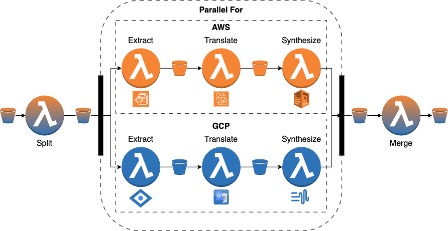

# read-for-me

With the rise of digital accessibility, there is an increasing demand for
audio-based content. Audio books help the visually impaired read. Audio description makes movies
accessible. Unfortunately, adaptive technology and accessibility features are often expensive if they are available
at all. So what do you do when the content isn’t available as audio? This problem
is addressed by read-for-me, which creates natural-sounding speech in
multiple languages from a pdf document, such that visually impaired people can hear documents.

# Workflow

The workflow orchestrates five functions: (F1)
**Split** cuts the input file into several smaller files such that the iterations of the following loop have similar
execution times. Furthermore, it gathers the url’s of the files and counts them; (F2) **Extract**
takes a document and returns the plain text contained in it; (F3) **Translate** translates text from source language
into target language; (F4) Synthesize converts
the text to natural sounding speech; (F5) **Merge** concatenates the audio files into a single file. All functions read
and write from and to cloud storage. All functions use cloud storage and the functions extract, translate and
synthesize use additional cloud services.


The workflow was distributed across two providers, which allows to overcome concurrency limitations of single
providers.



## Folder structure

[/split](split), [/extract](extract), [/translate](translate), [/synthesize](synthesize) and [/merge](merge) are maven
modules, which contain the code for the serverless functions. [/workflow](workflow) contains the executable jar of the
xAFCL enactment engine, several workflows written in
AFCL and some json files, representing the workflow input. [/deployment](deployment) contains the terraform IaC scripts
for
deployment automation. [/samples](samples) holds some sample data, which can
be used for testing and debugging. [/docs](docs) contains some figures and documentation.

# Setup

Create a credentials.json file in the root folder of the project and insert the AWS and GCP credentials.

The ```gcp_client_credentials``` field is optional to specify GCP Client credentials.
They will be used to authenticate to the services when specified, orhterwise the ```gcp_credentials``` will be used.

```json
{
  "aws_credentials": {
    "accessKey": "",
    "secretKey": "",
    "token": ""
  },
  "gcp_credentials": {
    "type": "",
    "project_id": "",
    "private_key_id": "",
    "private_key": "",
    "client_email": "",
    "client_id": "",
    "auth_uri": "",
    "token_uri": "",
    "auth_provider_x509_cert_url": "",
    "client_x509_cert_url": ""
  }, 
  "gcp_client_credentials": {
    "client_id": "",
    "client_secret": "",
    "quota_project_id": "",
    "refresh_token": "",
    "type": ""
  }
}
```

Next, run the setup python script.

```bash
$ python setup.py
```

This will copy the credentials in all locations where they may be needed (e.g. Terraform, Functions, xAFCL).

Next, run the maven build. This uses the maven shade plugin to package all the code and the necessary dependencies into
jar archives (so-called "
fat" jars).

```bash
$ mvn clean install
```

Finally, deploy the functions to both providers.

```bash
$ terraform init
$ terraform plan
$ terraform apply
```

# Input

The workflows inputs allow to specify the configuration of the region.
(See e.g. [/workflow/input-amazon.json](/workflow/input-amazon.json) as an example.)

If the `serviceRegions` are left unspecified or empty the default configuration will be used, which is:

- closest to the function for `call-by-val`
- closest to the bucket for `call-by-ref`

## Pitfalls
Note that different services might only be available for different regions.
GCP Translate for example only allows `[us-west1, eu-west1]`, while GCP T2S and S2T only allow `[us, eu]`


# Execution

Change working directory.

```bash
$ cd workflow
```

Run the workflow on amazon:

```bash
java -jar ee.jar fc-amazon.yaml input-amazon.json
```

Run the workflow on google:

```bash
java -jar ee.jar fc-google.yaml input-google.json
```

Run the distributed version of the workflow:

```bash
java -jar ee.jar fc-distributed.yaml input-distributed.json
```

The warm-up-workflow invokes every function once and can be used to warm up all functions and avoid cold starts.

```bash
java -jar ee.jar fc-warumup.yaml input-warumup.json
```
